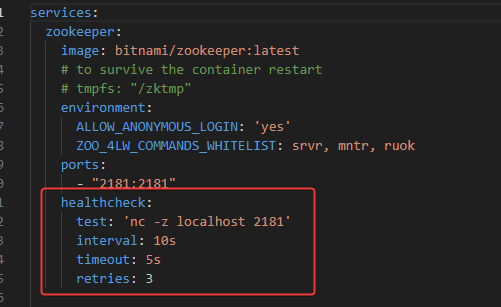
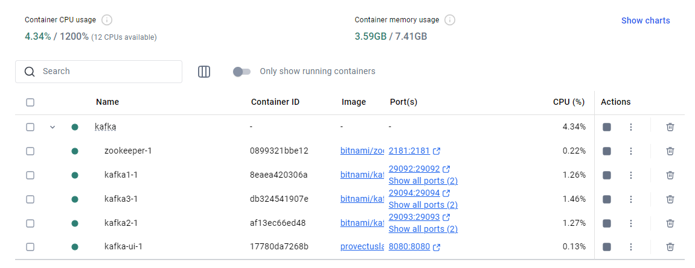
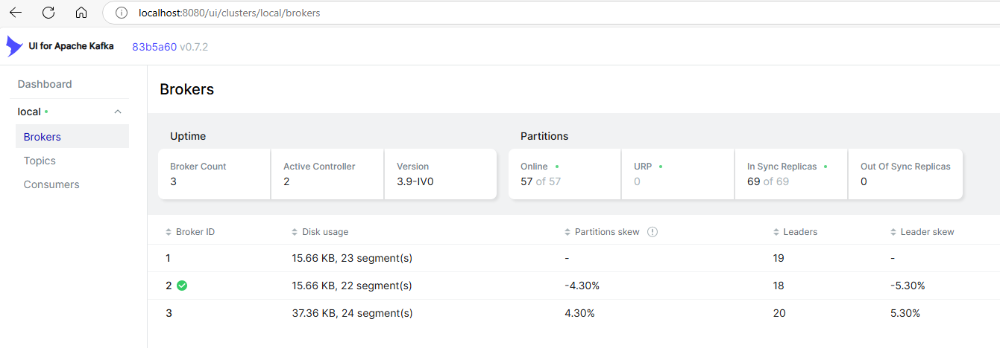
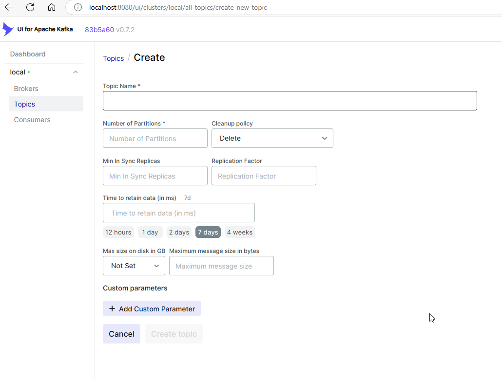
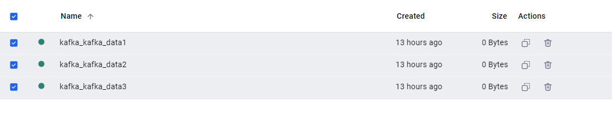
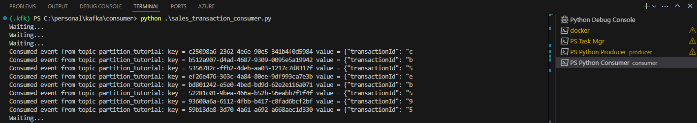
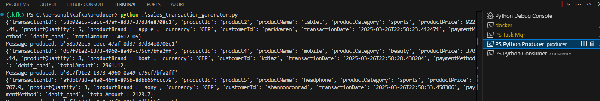

# Apache Kafka 3 Node Cluster with UI & Sample Producer Consumer Scripts

This code base is built to illustrate the Apache Kakfa 3 Node/Broker cluster setup for docker desktop via compose. 

Addtionally in this I have also added in the Producer and Comsumer script with Fake data to illustrate the working of Kafa and it internals. In this script I have used confluent_kafka to inerface the operations via python. 

## Description

### Starting Kafka Cluster with UI

Upon download of the script run the following command to spin up the Apache Kafka cluster setup

> docker compose up -d

In this setup, I have added a healthcheck to zookeeper to ensure the sequence of operation and cluster health. 

This health check status can be viewed by the following command

> docker inspect --format "{{json .State.Health }}" kafka-zookeeper-1

Once the cluster is up and running you can view the following

And the [Apache Kafka UI](https://github.com/provectus/kafka-ui) can be accessed via the following URL [http://localhost:8080/](http://localhost:8080/)

Once the cluster is up and running, from the UI one can create the relevant topics as desired with the required configurations

*Note: For the Kafka cluster setup volumes are created in the docker desktop for the data storage so please ensure for re-builds they are cleaned-up for rebuild as to avoid new randomly generated clusterkeys coflict*

[Stackoverflow - Kafka Broker doesn't find cluster id and creates new one after docker restart](https://stackoverflow.com/questions/59592518/kafka-broker-doesnt-find-cluster-id-and-creates-new-one-after-docker-restart)

**Reference Article** - [Medium - Setup Local Kafka Cluster with Kafka-UI Enabled Using Docker Desktop](https://medium.com/@caoyang1024/setup-local-kafka-cluster-with-kafka-ui-enabled-using-docker-desktop-9293f733cf28)

### Python Producer and Consumer Scripts

Now once the above steps are completed for the Kafka containers and cluster is Up and Running.

Now we can progress on to running the producer and consumer python scripts which leverage the following library

- [Python Faker](https://faker.readthedocs.io/en/stable/index.html)
- [Confluent Kafka](https://docs.confluent.io/kafka-clients/python/current/overview.html#python-installation)
    - [Producer](https://docs.confluent.io/kafka-clients/python/current/overview.html#initialization) - [Example](https://developer.confluent.io/get-started/python/#build-producer)
    - [Consumer](https://docs.confluent.io/kafka-clients/python/current/overview.html#id1) - [Example](https://developer.confluent.io/get-started/python/#build-consumer)

And the above setup can be run in multiple terminals of the VS Code as follows: 

**Consumer**

**Producer**

**Reference Article** - [Apache Flink E-Commerce Analytics with Elasticsearch and Postgres](https://github.com/airscholar/FlinkCommerce/tree/main)